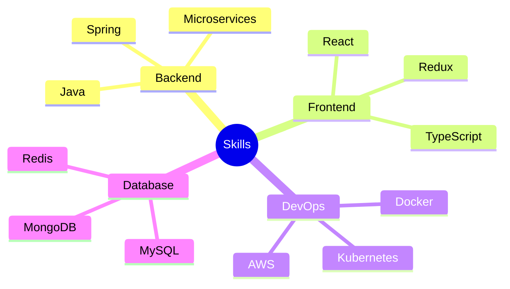

<div align="center">
  
  
</div>

<div align="left">

<table>
<tr>
<td width="60%">

# 👨‍💻 About
  

```typescript
class Developer {
  name     = "Anvesh Srivastava"
  role     = "Full Stack Developer"
  location = "India"
  work     = {
    current: "Student Developer",
    focus: "Backend Development"
  }
  interests = [
    "System Design",
    "Cloud Architecture",
    "DevOps",
    "Problem Solving"
  ]
}
```

</td>
<td>

## 🌟 Quick Stats
  
[](https://github.com/rookieanvesh)
[](https://github.com/rookieanvesh)
[](https://github.com/rookieanvesh)


</td>
</tr>
</table>

---

## 🎯 Top Results

<table>
<tr>
<td width="60%">

### 🔍 Featured Skills


</td>
<td>

### 📊 Code Stats


</td>
</tr>
</table>

---

## 🔎 Search Results

<details open>
<summary><strong>🏆 Coding Achievements</strong></summary>

<table>
<tr>
<td width="50%">

### LeetCode Stats


</td>
<td width="50%">

### GeeksForGeeks Stats


</td>
</tr>
</table>

</details>

<details>
<summary><strong>📂 Featured Projects</strong></summary>

### People Also Viewed
<table>
<tr>
<td width="33%">
<a href="https://github.com/rookieanvesh/hotel-management">

</a>
</td>
<td width="33%">
<a href="https://github.com/rookieanvesh/microservices">

</a>
</td>
<td width="33%">
<a href="https://github.com/rookieanvesh/job-portal">

</a>
</td>
</tr>
</table>

</details>

<details>
<summary><strong>📈 GitHub Analytics</strong></summary>

<table>
<tr>
<td width="50%">

### Activity Metrics


</td>
<td width="50%">

### Contribution Overview


</td>
</tr>
</table>

</details>

---

## 🔗 Related Links
<div align="center">

[](https://github.com/rookieanvesh)
[](https://www.linkedin.com/in/anvesh-/)
[](mailto:srivastavaanvesh13@gmail.com)
[](https://leetcode.com/rookieanvesh/)


</div>

<div align="center">
    <details>
        <summary><h3>💡 Page Info</h3></summary>
        <table>
        <tr>
        <td>
        
### Did you find what you were looking for?
- Yes? Give it a ⭐ to show your support!
- No? [Open an issue](https://github.com/rookieanvesh/rookieanvesh/issues) with your suggestion!
        
</td>
</tr>
</table>
    </details>
</div>

<div align="center">
<table><tr><td>
<h6>Page 1 of about 1,337,420 results (0.42 seconds)<br>
© 2024 - Made with 🔍 Google Search</h6>
</td></tr></table>
</div>

</div>
